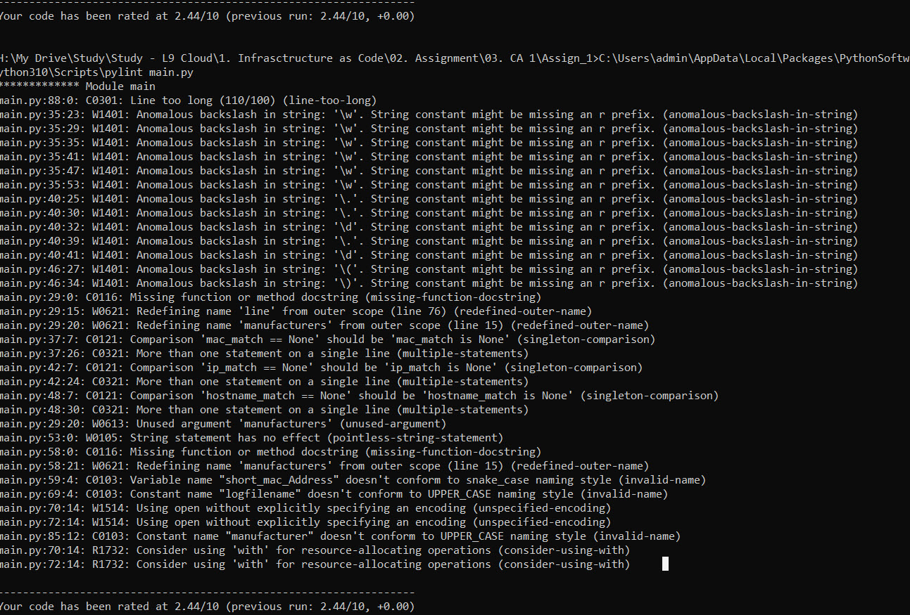
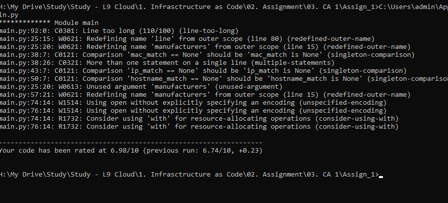

# Infrastructure as code - Assignment 1 - Read Me (Testing) #
This read me file is intended to show the testing completed on this programme. 

>A test was completed using pylint (1st Check)

>The follwing results were displayed and reviewed. 

************* Module main
main.py:21:45: C0303: Trailing whitespace (trailing-whitespace)
main.py:32:0: C0303: Trailing whitespace (trailing-whitespace)
main.py:38:0: C0303: Trailing whitespace (trailing-whitespace)
main.py:45:0: C0303: Trailing whitespace (trailing-whitespace)
main.py:62:0: C0325: Unnecessary parens after 'if' keyword (superfluous-parens) 
main.py:70:0: C0303: Trailing whitespace (trailing-whitespace)
main.py:80:55: C0303: Trailing whitespace (trailing-whitespace)
main.py:80:0: C0325: Unnecessary parens after 'if' keyword (superfluous-parens)
main.py:82:0: C0303: Trailing whitespace (trailing-whitespace)
main.py:87:110: C0303: Trailing whitespace (trailing-whitespace)
main.py:87:0: C0301: Line too long (110/100) (line-too-long)
main.py:91:0: C0303: Trailing whitespace (trailing-whitespace)
main.py:30:23: W1401: Anomalous backslash in string: '\w'. String constant might be missing an r prefix. (anomalous-backslash-in-string)
main.py:30:29: W1401: Anomalous backslash in string: '\w'. String constant might be missing an r prefix. (anomalous-backslash-in-string)
main.py:30:35: W1401: Anomalous backslash in string: '\w'. String constant might be missing an r prefix. (anomalous-backslash-in-string)
main.py:30:41: W1401: Anomalous backslash in string: '\w'. String constant might be missing an r prefix. (anomalous-backslash-in-string)
main.py:30:47: W1401: Anomalous backslash in string: '\w'. String constant might be missing an r prefix. (anomalous-backslash-in-string)
main.py:30:53: W1401: Anomalous backslash in string: '\w'. String constant might be missing an r prefix. (anomalous-backslash-in-string)
main.py:36:25: W1401: Anomalous backslash in string: '\.'. String constant might be missing an r prefix. (anomalous-backslash-in-string)
main.py:36:30: W1401: Anomalous backslash in string: '\.'. String constant might be missing an r prefix. (anomalous-backslash-in-string)
main.py:36:32: W1401: Anomalous backslash in string: '\d'. String constant might be missing an r prefix. (anomalous-backslash-in-string)
main.py:36:39: W1401: Anomalous backslash in string: '\.'. String constant might be missing an r prefix. (anomalous-backslash-in-string)
main.py:36:41: W1401: Anomalous backslash in string: '\d'. String constant might be missing an r prefix. (anomalous-backslash-in-string)
main.py:43:27: W1401: Anomalous backslash in string: '\('. String constant might be missing an r prefix. (anomalous-backslash-in-string)
main.py:43:34: W1401: Anomalous backslash in string: '\)'. String constant might be missing an r prefix. (anomalous-backslash-in-string)
main.py:1:0: C0114: Missing module docstring (missing-module-docstring)
main.py:24:0: C0116: Missing function or method docstring (missing-function-docstring)
main.py:24:15: W0621: Redefining name 'line' from outer scope (line 74) (redefined-outer-name)
main.py:24:20: W0621: Redefining name 'manufacturers' from outer scope (line 11) (redefined-outer-name)
main.py:33:7: C0121: Comparison 'mac_match == None' should be 'mac_match is None' (singleton-comparison)
main.py:33:26: C0321: More than one statement on a single line (multiple-statements)
main.py:39:7: C0121: Comparison 'ip_match == None' should be 'ip_match is None' (singleton-comparison)
main.py:39:26: C0321: More than one statement on a single line (multiple-statements)
main.py:46:7: C0121: Comparison 'hostname_match == None' should be 'hostname_match is None' (singleton-comparison)
main.py:46:31: C0321: More than one statement on a single line (multiple-statements)
main.py:24:20: W0613: Unused argument 'manufacturers' (unused-argument)
main.py:53:0: C0116: Missing function or method docstring (missing-function-docstring)
main.py:53:21: W0621: Redefining name 'manufacturers' from outer scope (line 11) (redefined-outer-name)
main.py:54:4: C0103: Variable name "short_mac_Address" doesn't conform to snake_case naming style (invalid-name)
main.py:65:4: C0103: Constant name "logfilename" doesn't conform to UPPER_CASE naming style (invalid-name)
main.py:66:14: W1514: Using open without explicitly specifying an encoding (unspecified-encoding)
main.py:69:14: W1514: Using open without explicitly specifying an encoding (unspecified-encoding)
main.py:84:12: C0103: Constant name "manufacturer" doesn't conform to UPPER_CASE naming style (invalid-name)
main.py:66:14: R1732: Consider using 'with' for resource-allocating operations (consider-using-with)
main.py:69:14: R1732: Consider using 'with' for resource-allocating operations (consider-using-with)
main.py:1:0: W0611: Unused import csv (unused-import)

------------------------------------------------------------------
Your code has been rated at 0.00/10 (previous run: 0.00/10, +0.00)

>A test was completed using pylint (2nd Check)

>The follwing results were displayed and reviewed. This was the last test completed with a rating of 6.98. 

************* Module main
main.py:92:0: C0301: Line too long (110/100) (line-too-long)
main.py:25:15: W0621: Redefining name 'line' from outer scope (line 80) (redefined-outer-name)
main.py:25:20: W0621: Redefining name 'manufacturers' from outer scope (line 15) (redefined-outer-name)
main.py:38:7: C0121: Comparison 'mac_match == None' should be 'mac_match is None' (singleton-comparison)
main.py:38:26: C0321: More than one statement on a single line (multiple-statements)
main.py:43:7: C0121: Comparison 'ip_match == None' should be 'ip_match is None' (singleton-comparison)
main.py:50:7: C0121: Comparison 'hostname_match == None' should be 'hostname_match is None' (singleton-comparison)
main.py:25:20: W0613: Unused argument 'manufacturers' (unused-argument)
main.py:57:21: W0621: Redefining name 'manufacturers' from outer scope (line 15) (redefined-outer-name)
main.py:74:14: W1514: Using open without explicitly specifying an encoding (unspecified-encoding)
main.py:76:14: W1514: Using open without explicitly specifying an encoding (unspecified-encoding)
main.py:74:14: R1732: Consider using 'with' for resource-allocating operations (consider-using-with)
main.py:76:14: R1732: Consider using 'with' for resource-allocating operations (consider-using-with)

-----------------------------------------------------------------
Your code has been rated at 6.98/10 (previous run: 6.74/10, +0.23)

